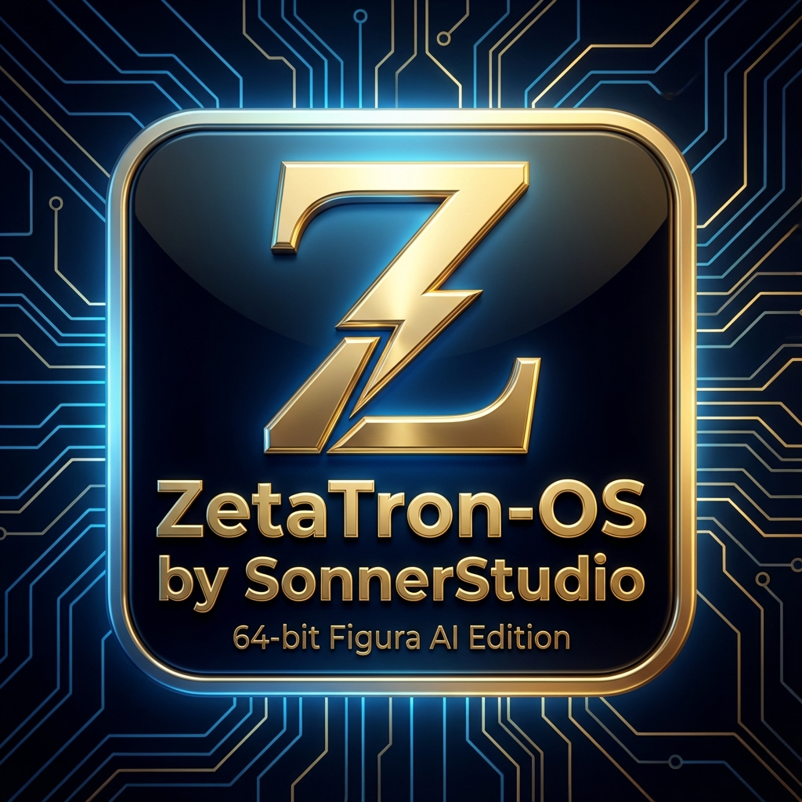

# ZetaTron-OS-64-Figura-AI-Edition

### The AI-Native Operating System of the Future

---

### 🌍 Language / Sprache / Langue / Idioma / Língua / שפה / 言語

[🇬🇧 English](#english) | [🇩🇪 Deutsch](#deutsch) | [🇫🇷 Français](#français) | [🇪🇸 Español](#español) | [🇵🇹 Português](#português) | [🇮🇱 עברית](#עברית) | [🇯🇵 日本語](#日本語)

---

## 🇬🇧 English

### What is ZetaTron-OS-64-Figura-AI-Edition?

**ZetaTron-OS-64** is a revolutionary, AI-native operating system specifically designed for the demands of modern artificial intelligence. It combines three innovative technologies into a unique ecosystem:

#### 🧠 **Figura AI** – The Intelligent Core
A sophisticated AI system with **74 specialized modules** distributed across **5 main engines**:
- **Core Engine (Atlas)** – Central system coordination
- **Investigation Engine (Spector)** – 37 analysis modules for pattern recognition
- **SSASE Engine (David)** – 18 stability and security modules
- **Sequence Engine (Mechlar)** – Workflow planning and construction
- **IE/SE Combination Engine (McGyver)** – Creative synthesis

#### ⚡ **Sonner Studio Language (SSL)** – The Language of the Future
All system components are developed in the proprietary **SSL** programming language, designed for modern requirements:
- **Native Concurrency** – Parallel processes without overhead
- **Distributed Execution** – Cluster computing out of the box
- **Quantum Primitives** – Prepared for quantum computing
- **Self-Healing** – Automatic error correction

#### 🖥️ **ZetaTron Hybrid Kernel** – The Foundation
A revolutionary kernel combining the best of both worlds:
- **Zero-Overhead AI Execution** – Direct hardware control
- **Cross-Platform Compatibility** – Run Windows/Linux software natively
- **FIGCOM Protocol** – Ultra-fast inter-engine communication (<0.1ms)
- **Hot-Swap Modules** – Replace components during runtime

### 🎯 Key Features

- **Dedicated System per Module**: Each of the 74 modules can run on its own machine or dedicated rack with GPU
- **Nexus-Cluster-Master**: Central coordination of distributed Figura AI instances
- **Atlas Terminal**: Premium GUI with real-time monitoring
- **Four Pillars of Security**: Arminius, Lancelot, Merlin, Herakles
- **Boot Time**: <5s (cold), <2s (warm)
- **Failover**: <50ms automatic recovery

### 📊 Technical Specifications

| Feature | Specification |
|---------|--------------|
| **Engines** | 5 main engines with 74 modules |
| **Communication** | FIGCOM Protocol (<0.1ms latency) |
| **Language** | Sonner Studio Language (SSL) |
| **Platforms** | x86-64, ARM64, RISC-V (planned) |
| **GPU Support** | NVIDIA CUDA, AMD ROCm, Intel Arc |

### 🗓️ Roadmap

- **Q1 2026** – Kernel Foundation & FIGCOM Protocol
- **Q2 2026** – Engine Integration
- **Q3 2026** – GUI & User Experience
- **Q4 2026** – Hardware & Driver Layer
- **Q1 2027** – Security & Hardening
- **Q2 2027** – Public Alpha Release

### 📄 License

ZetaTron-OS-64 is available under a **dual license**:
- **Freeware** for private and academic use
- **Commercial License** for enterprises with support & SLAs

Source code and development documents are confidential and exclusively for SonnerStudio.

### 🔗 Links

- [Figura AI Wiki](https://github.com/SonnerStudio/Figura-KI---Figura-AI/wiki)
- [Sonner Studio Language](https://github.com/SonnerStudio/Sonner-Studio-Language_SSL)
- [Technical Specification](docs/zetatron_os_specification.md)

### 👨‍💼 About SonnerStudio

SonnerStudio is an innovative technology company specializing in the development of cutting-edge AI systems and programming languages. Under the leadership of Director Jan Friske, SonnerStudio combines academic excellence with practical innovation.

---

## 🇩🇪 Deutsch

### Was ist ZetaTron-OS-64-Figura-AI-Edition?

**ZetaTron-OS-64** ist ein revolutionäres, KI-natives Betriebssystem, das speziell für die Anforderungen moderner künstlicher Intelligenz entwickelt wurde. Es vereint drei innovative Technologien zu einem einzigartigen Ökosystem:

#### 🧠 **Figura AI** – Das intelligente Herz
Ein hochentwickeltes KI-System mit **74 spezialisierten Modulen**, verteilt auf **5 Haupt-Engines**:
- **Core Engine (Atlas)** – Zentrale Systemkoordination
- **Investigation Engine (Spector)** – 37 Analysemodule für Mustererkennung
- **SSASE Engine (David)** – 18 Stabilitäts- und Sicherheitsmodule
- **Sequence Engine (Mechlar)** – Ablaufplanung und Konstruktion
- **IE/SE Combination Engine (McGyver)** – Kreative Synthese

#### ⚡ **Sonner Studio Language (SSL)** – Die Sprache der Zukunft
Alle Systemkomponenten werden in der hauseigenen Programmiersprache **SSL** entwickelt:
- **Native Concurrency** – Parallele Prozesse ohne Overhead
- **Distributed Execution** – Cluster-Computing aus der Box
- **Quantum Primitives** – Vorbereitet für Quantencomputing
- **Self-Healing** – Automatische Fehlerkorrektur

#### 🖥️ **ZetaTron Hybrid Kernel** – Die Basis
Ein revolutionärer Kernel, der das Beste aus beiden Welten vereint:
- **Zero-Overhead AI Execution** – Direkte Hardware-Kontrolle
- **Cross-Platform Kompatibilität** – Windows/Linux-Software nativ ausführbar
- **FIGCOM Protocol** – Ultra-schnelle Inter-Engine-Kommunikation (<0.1ms)
- **Hot-Swap Module** – Komponenten im laufenden Betrieb austauschen

### 🎯 Hauptmerkmale

- **Dediziertes System pro Modul**: Jedes der 74 Module kann auf eigenem Rechner oder Rack mit GPU laufen
- **Nexus-Cluster-Master**: Zentrale Koordination verteilter Figura AI Instanzen
- **Atlas Terminal**: Premium-GUI mit Echtzeit-Monitoring
- **Vier Säulen der Sicherheit**: Arminius, Lancelot, Merlin, Herakles
- **Boot-Zeit**: <5s (kalt), <2s (warm)
- **Failover**: <50ms automatische Wiederherstellung

### 📊 Technische Spezifikationen

| Feature | Spezifikation |
|---------|--------------|
| **Engines** | 5 Haupt-Engines mit 74 Modulen |
| **Kommunikation** | FIGCOM Protocol (<0.1ms Latenz) |
| **Sprache** | Sonner Studio Language (SSL) |
| **Plattformen** | x86-64, ARM64, RISC-V (geplant) |
| **GPU-Support** | NVIDIA CUDA, AMD ROCm, Intel Arc |

### 🗓️ Roadmap

- **Q1 2026** – Kernel Foundation & FIGCOM Protocol
- **Q2 2026** – Engine Integration
- **Q3 2026** – GUI & User Experience
- **Q4 2026** – Hardware & Driver Layer
- **Q1 2027** – Security & Hardening
- **Q2 2027** – Public Alpha Release

### 📄 Lizenz

ZetaTron-OS-64 ist unter einer **Dual-Lizenz** verfügbar:
- **Freeware** für private und akademische Nutzung
- **Commercial License** für Unternehmen mit Support & SLAs

Quellcode und Entwicklungsdokumente sind vertraulich und ausschließlich für SonnerStudio.

### 🔗 Links

- [Figura AI Wiki](https://github.com/SonnerStudio/Figura-KI---Figura-AI/wiki)
- [Sonner Studio Language](https://github.com/SonnerStudio/Sonner-Studio-Language_SSL)
- [Technische Spezifikation](docs/zetatron_os_specification.md)

### 👨‍💼 Über SonnerStudio

SonnerStudio ist ein innovatives Technologieunternehmen, das sich auf die Entwicklung zukunftsweisender KI-Systeme und Programmiersprachen spezialisiert hat. Unter der Leitung von Direktor Jan Friske verbindet SonnerStudio akademische Exzellenz mit praktischer Innovation.

---

## 🇫🇷 Français

### Qu'est-ce que ZetaTron-OS-64-Figura-AI-Edition ?

**ZetaTron-OS-64** est un système d'exploitation révolutionnaire, natif de l'IA, spécialement conçu pour les exigences de l'intelligence artificielle moderne. Il combine trois technologies innovantes en un écosystème unique :

#### 🧠 **Figura AI** – Le Cœur Intelligent
Un système d'IA sophistiqué avec **74 modules spécialisés** répartis sur **5 moteurs principaux** :
- **Core Engine (Atlas)** – Coordination centrale du système
- **Investigation Engine (Spector)** – 37 modules d'analyse pour la reconnaissance de motifs
- **SSASE Engine (David)** – 18 modules de stabilité et de sécurité
- **Sequence Engine (Mechlar)** – Planification et construction de flux de travail
- **IE/SE Combination Engine (McGyver)** – Synthèse créative

#### ⚡ **Sonner Studio Language (SSL)** – Le Langage du Futur
Tous les composants système sont développés dans le langage de programmation propriétaire **SSL** :
- **Concurrence Native** – Processus parallèles sans surcharge
- **Exécution Distribuée** – Calcul en cluster prêt à l'emploi
- **Primitives Quantiques** – Préparé pour l'informatique quantique
- **Auto-Réparation** – Correction automatique des erreurs

#### 🖥️ **ZetaTron Hybrid Kernel** – La Fondation
Un noyau révolutionnaire combinant le meilleur des deux mondes :
- **Exécution IA Sans Surcharge** – Contrôle matériel direct
- **Compatibilité Multi-Plateforme** – Exécution native de logiciels Windows/Linux
- **Protocole FIGCOM** – Communication ultra-rapide entre moteurs (<0.1ms)
- **Modules Hot-Swap** – Remplacement de composants pendant l'exécution

### 🎯 Caractéristiques Principales

- **Système Dédié par Module** : Chacun des 74 modules peut fonctionner sur sa propre machine ou rack avec GPU
- **Nexus-Cluster-Master** : Coordination centrale des instances Figura AI distribuées
- **Atlas Terminal** : Interface graphique premium avec surveillance en temps réel
- **Quatre Piliers de Sécurité** : Arminius, Lancelot, Merlin, Herakles
- **Temps de Démarrage** : <5s (froid), <2s (chaud)
- **Basculement** : Récupération automatique <50ms

### 📊 Spécifications Techniques

| Fonctionnalité | Spécification |
|----------------|---------------|
| **Moteurs** | 5 moteurs principaux avec 74 modules |
| **Communication** | Protocole FIGCOM (latence <0.1ms) |
| **Langage** | Sonner Studio Language (SSL) |
| **Plateformes** | x86-64, ARM64, RISC-V (prévu) |
| **Support GPU** | NVIDIA CUDA, AMD ROCm, Intel Arc |

### 🗓️ Feuille de Route

- **T1 2026** – Fondation du noyau & Protocole FIGCOM
- **T2 2026** – Intégration des moteurs
- **T3 2026** – Interface graphique & Expérience utilisateur
- **T4 2026** – Matériel & Couche pilote
- **T1 2027** – Sécurité & Durcissement
- **T2 2027** – Version Alpha publique

### 📄 Licence

ZetaTron-OS-64 est disponible sous une **double licence** :
- **Freeware** pour usage privé et académique
- **Licence Commerciale** pour les entreprises avec support & SLA

Le code source et les documents de développement sont confidentiels et exclusifs à SonnerStudio.

### 🔗 Liens

- [Wiki Figura AI](https://github.com/SonnerStudio/Figura-KI---Figura-AI/wiki)
- [Sonner Studio Language](https://github.com/SonnerStudio/Sonner-Studio-Language_SSL)
- [Spécification Technique](docs/zetatron_os_specification.md)

### 👨‍💼 À Propos de SonnerStudio

SonnerStudio est une entreprise technologique innovante spécialisée dans le développement de systèmes d'IA de pointe et de langages de programmation. Sous la direction du directeur Jan Friske, SonnerStudio combine l'excellence académique avec l'innovation pratique.

---

## 🇪🇸 Español

### ¿Qué es ZetaTron-OS-64-Figura-AI-Edition?

**ZetaTron-OS-64** es un sistema operativo revolucionario, nativo de IA, diseñado específicamente para las demandas de la inteligencia artificial moderna. Combina tres tecnologías innovadoras en un ecosistema único:

#### 🧠 **Figura AI** – El Núcleo Inteligente
Un sistema de IA sofisticado con **74 módulos especializados** distribuidos en **5 motores principales**:
- **Core Engine (Atlas)** – Coordinación central del sistema
- **Investigation Engine (Spector)** – 37 módulos de análisis para reconocimiento de patrones
- **SSASE Engine (David)** – 18 módulos de estabilidad y seguridad
- **Sequence Engine (Mechlar)** – Planificación y construcción de flujos de trabajo
- **IE/SE Combination Engine (McGyver)** – Síntesis creativa

#### ⚡ **Sonner Studio Language (SSL)** – El Lenguaje del Futuro
Todos los componentes del sistema se desarrollan en el lenguaje de programación propietario **SSL**:
- **Concurrencia Nativa** – Procesos paralelos sin sobrecarga
- **Ejecución Distribuida** – Computación en clúster lista para usar
- **Primitivas Cuánticas** – Preparado para computación cuántica
- **Auto-Reparación** – Corrección automática de errores

#### 🖥️ **ZetaTron Hybrid Kernel** – La Base
Un núcleo revolucionario que combina lo mejor de ambos mundos:
- **Ejecución IA Sin Sobrecarga** – Control directo del hardware
- **Compatibilidad Multiplataforma** – Ejecuta software Windows/Linux nativamente
- **Protocolo FIGCOM** – Comunicación ultra-rápida entre motores (<0.1ms)
- **Módulos Hot-Swap** – Reemplazo de componentes durante la ejecución

### 🎯 Características Principales

- **Sistema Dedicado por Módulo**: Cada uno de los 74 módulos puede ejecutarse en su propia máquina o rack con GPU
- **Nexus-Cluster-Master**: Coordinación central de instancias Figura AI distribuidas
- **Atlas Terminal**: Interfaz gráfica premium con monitoreo en tiempo real
- **Cuatro Pilares de Seguridad**: Arminius, Lancelot, Merlin, Herakles
- **Tiempo de Arranque**: <5s (frío), <2s (caliente)
- **Conmutación por Error**: Recuperación automática <50ms

### 📊 Especificaciones Técnicas

| Característica | Especificación |
|----------------|----------------|
| **Motores** | 5 motores principales con 74 módulos |
| **Comunicación** | Protocolo FIGCOM (latencia <0.1ms) |
| **Lenguaje** | Sonner Studio Language (SSL) |
| **Plataformas** | x86-64, ARM64, RISC-V (planificado) |
| **Soporte GPU** | NVIDIA CUDA, AMD ROCm, Intel Arc |

### 🗓️ Hoja de Ruta

- **T1 2026** – Fundación del núcleo & Protocolo FIGCOM
- **T2 2026** – Integración de motores
- **T3 2026** – Interfaz gráfica & Experiencia de usuario
- **T4 2026** – Hardware & Capa de controladores
- **T1 2027** – Seguridad & Endurecimiento
- **T2 2027** – Lanzamiento Alpha público

### 📄 Licencia

ZetaTron-OS-64 está disponible bajo una **licencia dual**:
- **Freeware** para uso privado y académico
- **Licencia Comercial** para empresas con soporte & SLA

El código fuente y los documentos de desarrollo son confidenciales y exclusivos de SonnerStudio.

### 🔗 Enlaces

- [Wiki Figura AI](https://github.com/SonnerStudio/Figura-KI---Figura-AI/wiki)
- [Sonner Studio Language](https://github.com/SonnerStudio/Sonner-Studio-Language_SSL)
- [Especificación Técnica](docs/zetatron_os_specification.md)

### 👨‍💼 Acerca de SonnerStudio

SonnerStudio es una empresa tecnológica innovadora especializada en el desarrollo de sistemas de IA de vanguardia y lenguajes de programación. Bajo la dirección del director Jan Friske, SonnerStudio combina la excelencia académica con la innovación práctica.

---

## 🇵🇹 Português

### O que é ZetaTron-OS-64-Figura-AI-Edition?

**ZetaTron-OS-64** é um sistema operacional revolucionário, nativo de IA, projetado especificamente para as demandas da inteligência artificial moderna. Ele combina três tecnologias inovadoras em um ecossistema único:

#### 🧠 **Figura AI** – O Núcleo Inteligente
Um sistema de IA sofisticado com **74 módulos especializados** distribuídos em **5 motores principais**:
- **Core Engine (Atlas)** – Coordenação central do sistema
- **Investigation Engine (Spector)** – 37 módulos de análise para reconhecimento de padrões
- **SSASE Engine (David)** – 18 módulos de estabilidade e segurança
- **Sequence Engine (Mechlar)** – Planejamento e construção de fluxos de trabalho
- **IE/SE Combination Engine (McGyver)** – Síntese criativa

#### ⚡ **Sonner Studio Language (SSL)** – A Linguagem do Futuro
Todos os componentes do sistema são desenvolvidos na linguagem de programação proprietária **SSL**:
- **Concorrência Nativa** – Processos paralelos sem sobrecarga
- **Execução Distribuída** – Computação em cluster pronta para uso
- **Primitivas Quânticas** – Preparado para computação quântica
- **Auto-Recuperação** – Correção automática de erros

#### 🖥️ **ZetaTron Hybrid Kernel** – A Fundação
Um kernel revolucionário que combina o melhor de dois mundos:
- **Execução IA Sem Sobrecarga** – Controle direto do hardware
- **Compatibilidade Multiplataforma** – Execute software Windows/Linux nativamente
- **Protocolo FIGCOM** – Comunicação ultra-rápida entre motores (<0.1ms)
- **Módulos Hot-Swap** – Substituição de componentes durante a execução

### 🎯 Características Principais

- **Sistema Dedicado por Módulo**: Cada um dos 74 módulos pode ser executado em sua própria máquina ou rack com GPU
- **Nexus-Cluster-Master**: Coordenação central de instâncias Figura AI distribuídas
- **Atlas Terminal**: Interface gráfica premium com monitoramento em tempo real
- **Quatro Pilares de Segurança**: Arminius, Lancelot, Merlin, Herakles
- **Tempo de Inicialização**: <5s (frio), <2s (quente)
- **Failover**: Recuperação automática <50ms

### 📊 Especificações Técnicas

| Característica | Especificação |
|----------------|---------------|
| **Motores** | 5 motores principais com 74 módulos |
| **Comunicação** | Protocolo FIGCOM (latência <0.1ms) |
| **Linguagem** | Sonner Studio Language (SSL) |
| **Plataformas** | x86-64, ARM64, RISC-V (planejado) |
| **Suporte GPU** | NVIDIA CUDA, AMD ROCm, Intel Arc |

### 🗓️ Roteiro

- **T1 2026** – Fundação do kernel & Protocolo FIGCOM
- **T2 2026** – Integração de motores
- **T3 2026** – Interface gráfica & Experiência do usuário
- **T4 2026** – Hardware & Camada de drivers
- **T1 2027** – Segurança & Endurecimento
- **T2 2027** – Lançamento Alpha público

### 📄 Licença

ZetaTron-OS-64 está disponível sob uma **licença dupla**:
- **Freeware** para uso privado e acadêmico
- **Licença Comercial** para empresas com suporte & SLA

O código-fonte e os documentos de desenvolvimento são confidenciais e exclusivos da SonnerStudio.

### 🔗 Links

- [Wiki Figura AI](https://github.com/SonnerStudio/Figura-KI---Figura-AI/wiki)
- [Sonner Studio Language](https://github.com/SonnerStudio/Sonner-Studio-Language_SSL)
- [Especificação Técnica](docs/zetatron_os_specification.md)

### 👨‍💼 Sobre a SonnerStudio

SonnerStudio é uma empresa de tecnologia inovadora especializada no desenvolvimento de sistemas de IA de ponta e linguagens de programação. Sob a liderança do diretor Jan Friske, a SonnerStudio combina excelência acadêmica com inovação prática.

---

## 🇮🇱 עברית

### מה זה ZetaTron-OS-64-Figura-AI-Edition?

**ZetaTron-OS-64** הוא מערכת הפעלה מהפכנית, מקורית לבינה מלאכותית, שתוכננה במיוחד לדרישות הבינה המלאכותית המודרנית. היא משלבת שלוש טכנולוגיות חדשניות למערכת אקולוגית ייחודית:

#### 🧠 **Figura AI** – הליבה האינטליגנטית
מערכת בינה מלאכותית מתוחכמת עם **74 מודולים מיוחדים** המופצים על פני **5 מנועים ראשיים**:
- **Core Engine (Atlas)** – תיאום מרכזי של המערכת
- **Investigation Engine (Spector)** – 37 מודולי ניתוח לזיהוי דפוסים
- **SSASE Engine (David)** – 18 מודולי יציבות ואבטחה
- **Sequence Engine (Mechlar)** – תכנון ובניית זרימות עבודה
- **IE/SE Combination Engine (McGyver)** – סינתזה יצירתית

#### ⚡ **Sonner Studio Language (SSL)** – שפת העתיד
כל רכיבי המערכת מפותחים בשפת התכנות הקניינית **SSL**:
- **מקביליות מקורית** – תהליכים מקבילים ללא עומס יתר
- **ביצוע מבוזר** – מחשוב אשכולות מוכן לשימוש
- **פרימיטיבים קוונטיים** – מוכן למחשוב קוונטי
- **תיקון עצמי** – תיקון שגיאות אוטומטי

#### 🖥️ **ZetaTron Hybrid Kernel** – היסוד
ליבה מהפכנית המשלבת את הטוב משני העולמות:
- **ביצוע בינה מלאכותית ללא עומס יתר** – שליטה ישירה בחומרה
- **תאימות חוצת פלטפורמות** – הפעלת תוכנות Windows/Linux באופן מקורי
- **פרוטוקול FIGCOM** – תקשורת אולטרה-מהירה בין מנועים (<0.1ms)
- **מודולים Hot-Swap** – החלפת רכיבים במהלך הריצה

### 🎯 תכונות עיקריות

- **מערכת ייעודית למודול**: כל אחד מ-74 המודולים יכול לפעול על מכונה משלו או מתלה עם GPU
- **Nexus-Cluster-Master**: תיאום מרכזי של מופעי Figura AI מבוזרים
- **Atlas Terminal**: ממשק גרפי פרימיום עם ניטור בזמן אמת
- **ארבעה עמודי אבטחה**: Arminius, Lancelot, Merlin, Herakles
- **זמן אתחול**: <5s (קר), <2s (חם)
- **Failover**: שחזור אוטומטי <50ms

### 📊 מפרטים טכניים

| תכונה | מפרט |
|-------|------|
| **מנועים** | 5 מנועים ראשיים עם 74 מודולים |
| **תקשורת** | פרוטוקול FIGCOM (עיכוב <0.1ms) |
| **שפה** | Sonner Studio Language (SSL) |
| **פלטפורמות** | x86-64, ARM64, RISC-V (מתוכנן) |
| **תמיכה ב-GPU** | NVIDIA CUDA, AMD ROCm, Intel Arc |

### 🗓️ מפת דרכים

- **רבעון 1 2026** – יסוד הליבה ופרוטוקול FIGCOM
- **רבעון 2 2026** – שילוב מנועים
- **רבעון 3 2026** – ממשק גרפי וחוויית משתמש
- **רבעון 4 2026** – חומרה ושכבת מנהלי התקנים
- **רבעון 1 2027** – אבטחה וחיזוק
- **רבעון 2 2027** – שחרור אלפא ציבורי

### 📄 רישיון

ZetaTron-OS-64 זמין תחת **רישיון כפול**:
- **Freeware** לשימוש פרטי ואקדמי
- **רישיון מסחרי** לעסקים עם תמיכה ו-SLA

קוד המקור ומסמכי הפיתוח הם סודיים ובלעדיים ל-SonnerStudio.

### 🔗 קישורים

- [Wiki Figura AI](https://github.com/SonnerStudio/Figura-KI---Figura-AI/wiki)
- [Sonner Studio Language](https://github.com/SonnerStudio/Sonner-Studio-Language_SSL)
- [מפרט טכני](docs/zetatron_os_specification.md)

### 👨‍💼 אודות SonnerStudio

SonnerStudio היא חברת טכנולוגיה חדשנית המתמחה בפיתוח מערכות בינה מלאכותית מתקדמות ושפות תכנות. בהנהגת המנהל יאן פריסקה, SonnerStudio משלבת מצוינות אקדמית עם חדשנות מעשית.

---

## 🇯🇵 日本語

### ZetaTron-OS-64-Figura-AI-Editionとは？

**ZetaTron-OS-64**は、現代の人工知能の要求に特化して設計された革命的なAIネイティブオペレーティングシステムです。3つの革新的な技術を独自のエコシステムに統合しています：

#### 🧠 **Figura AI** – インテリジェントコア
**5つの主要エンジン**に分散された**74の専門モジュール**を持つ洗練されたAIシステム：
- **Core Engine (Atlas)** – 中央システム調整
- **Investigation Engine (Spector)** – パターン認識のための37の分析モジュール
- **SSASE Engine (David)** – 18の安定性とセキュリティモジュール
- **Sequence Engine (Mechlar)** – ワークフロー計画と構築
- **IE/SE Combination Engine (McGyver)** – 創造的合成

#### ⚡ **Sonner Studio Language (SSL)** – 未来の言語
すべてのシステムコンポーネントは独自のプログラミング言語**SSL**で開発されています：
- **ネイティブ並行性** – オーバーヘッドなしの並列プロセス
- **分散実行** – すぐに使えるクラスターコンピューティング
- **量子プリミティブ** – 量子コンピューティングに対応
- **自己修復** – 自動エラー修正

#### 🖥️ **ZetaTron Hybrid Kernel** – 基盤
両方の世界の最高を組み合わせた革命的なカーネル：
- **ゼロオーバーヘッドAI実行** – 直接ハードウェア制御
- **クロスプラットフォーム互換性** – Windows/Linuxソフトウェアをネイティブに実行
- **FIGCOMプロトコル** – 超高速エンジン間通信（<0.1ms）
- **ホットスワップモジュール** – 実行中のコンポーネント交換

### 🎯 主な機能

- **モジュールごとの専用システム**：74のモジュールそれぞれが独自のマシンまたはGPU付きラックで実行可能
- **Nexus-Cluster-Master**：分散Figura AIインスタンスの中央調整
- **Atlas Terminal**：リアルタイム監視付きプレミアムGUI
- **セキュリティの4つの柱**：Arminius、Lancelot、Merlin、Herakles
- **起動時間**：<5秒（コールド）、<2秒（ウォーム）
- **フェイルオーバー**：<50ms自動復旧

### 📊 技術仕様

| 機能 | 仕様 |
|------|------|
| **エンジン** | 74モジュールを持つ5つの主要エンジン |
| **通信** | FIGCOMプロトコル（<0.1msレイテンシ） |
| **言語** | Sonner Studio Language (SSL) |
| **プラットフォーム** | x86-64、ARM64、RISC-V（予定） |
| **GPUサポート** | NVIDIA CUDA、AMD ROCm、Intel Arc |

### 🗓️ ロードマップ

- **2026年第1四半期** – カーネル基盤とFIGCOMプロトコル
- **2026年第2四半期** – エンジン統合
- **2026年第3四半期** – GUIとユーザーエクスペリエンス
- **2026年第4四半期** – ハードウェアとドライバーレイヤー
- **2027年第1四半期** – セキュリティと堅牢化
- **2027年第2四半期** – パブリックアルファリリース

### 📄 ライセンス

ZetaTron-OS-64は**デュアルライセンス**で利用可能です：
- **フリーウェア** – 個人および学術利用向け
- **商用ライセンス** – サポートとSLA付き企業向け

ソースコードと開発文書は機密であり、SonnerStudio専用です。

### 🔗 リンク

- [Figura AI Wiki](https://github.com/SonnerStudio/Figura-KI---Figura-AI/wiki)
- [Sonner Studio Language](https://github.com/SonnerStudio/Sonner-Studio-Language_SSL)
- [技術仕様](docs/zetatron_os_specification.md)

### 👨‍💼 SonnerStudioについて

SonnerStudioは、最先端のAIシステムとプログラミング言語の開発を専門とする革新的なテクノロジー企業です。ディレクターのJan Friskeの指導の下、SonnerStudioは学術的卓越性と実用的イノベーションを組み合わせています。

---

### 🌟 Join the Future of AI Operating Systems

**ZetaTron-OS-64-Figura-AI-Edition**  
*Not just an OS. An Intelligent Ecosystem.*

---

© 2025 SonnerStudio. All Rights Reserved.  
Director: Jan Friske

